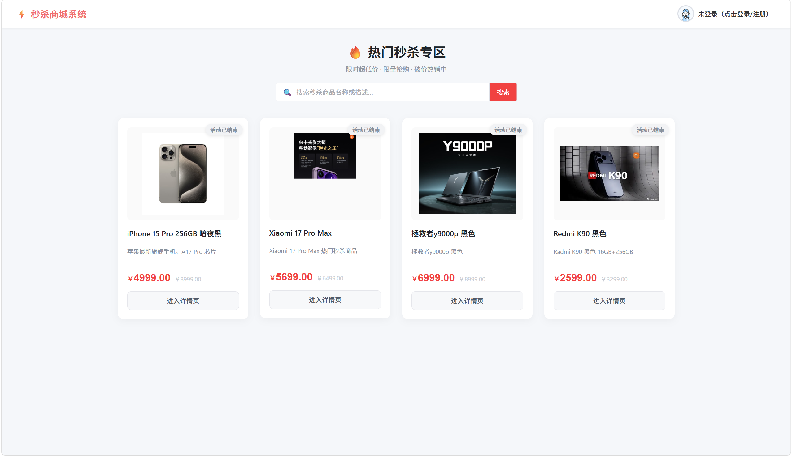
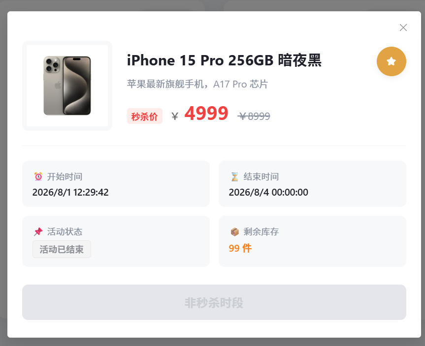
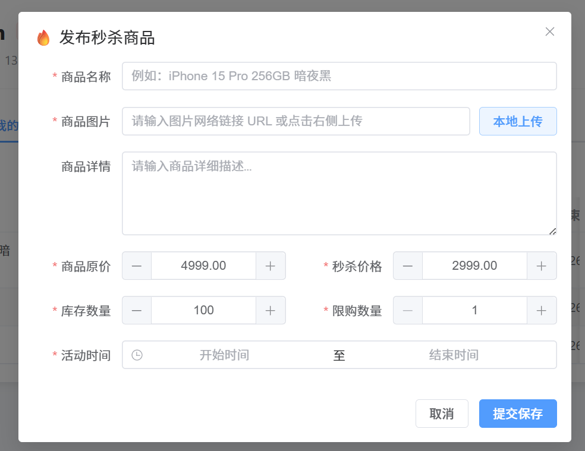
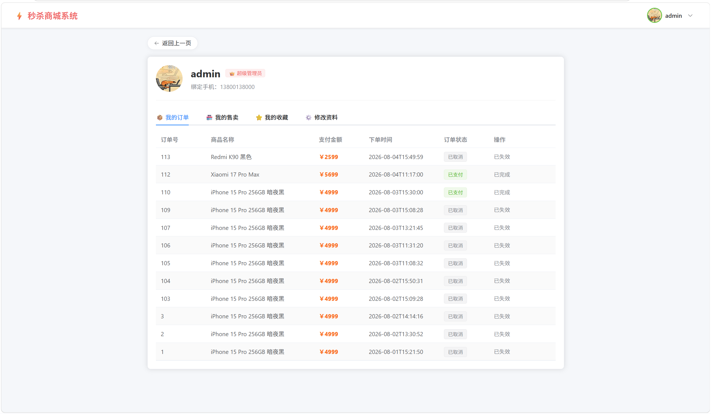
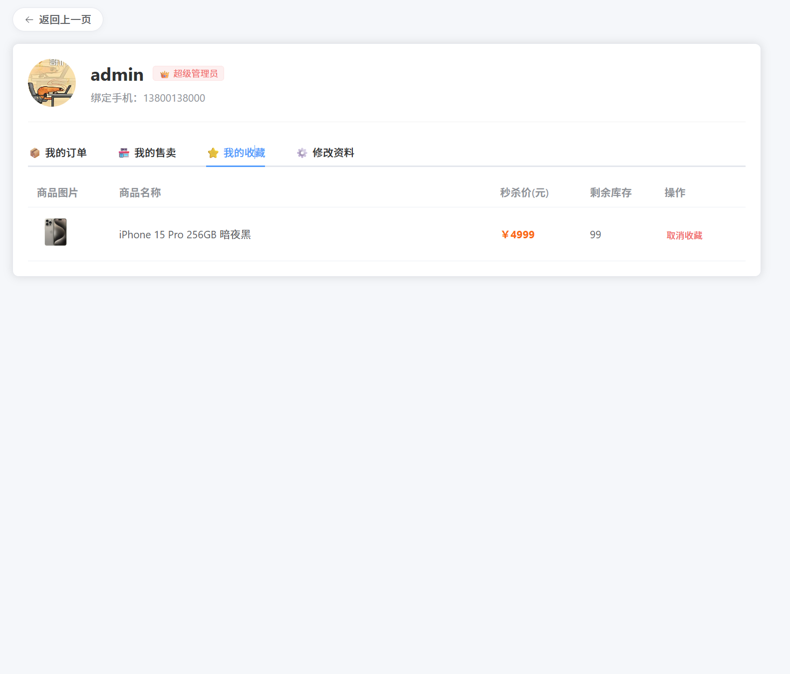
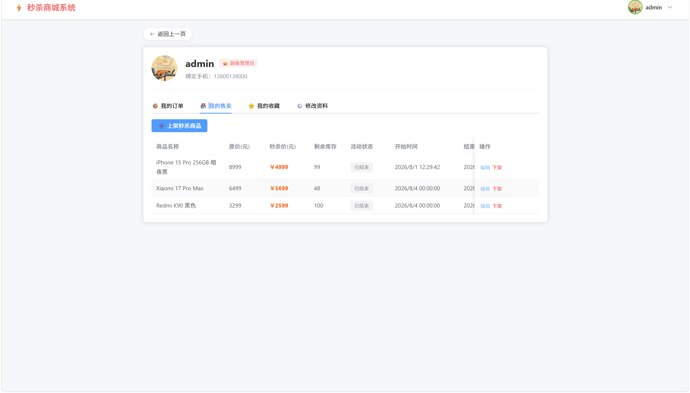
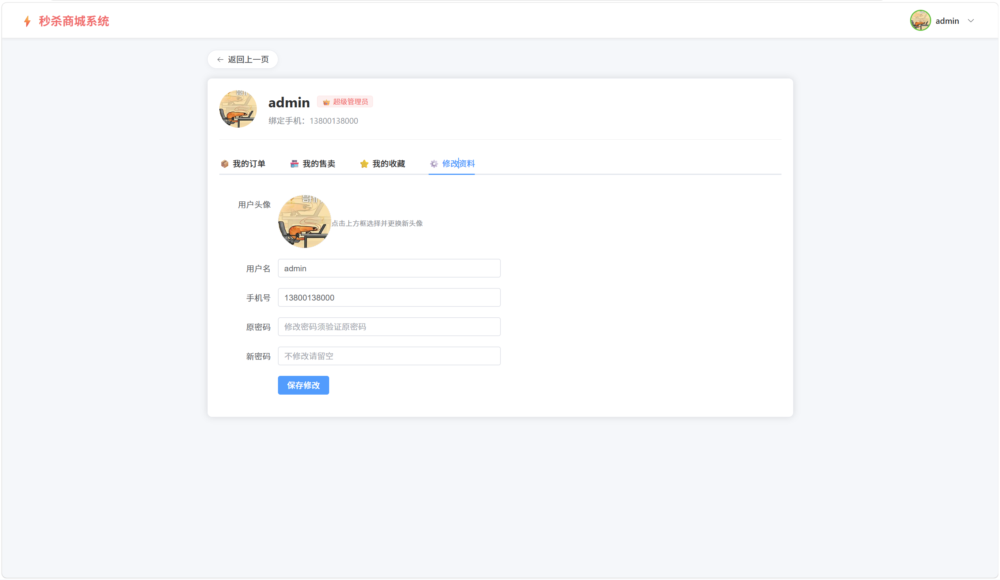

# 秒杀商城系统 (Flash Sale System)

基于 **Spring Boot 3 + Vue 3 + Redis + RabbitMQ** 实现的高并发秒杀商城平台。

## 技术栈
- **后端**：Java 17, Spring Boot 3, MyBatis-Plus, Redis, RabbitMQ, MySQL
- **前端**：Vue 3, Element Plus, Axios, Vue Router, Pinia

## 项目结构
- `flashsale`: Java 后端核心服务

- `flashsale-ui`: Vue 3 前端管理与用户界面

## 快速启动
1. 导入项目根目录下的 SQL 初始化脚本至 MySQL。
2. 修改 `flashsale/src/main/resources/application.yml` 中的 MySQL 和 Redis 连接信息。
3. 启动后端 `FlashsaleApplication.java`。
4. 进入 `flashsale-ui` 目录，执行 `npm install` 并运行 `npm run dev`。
5. 用户：admin 密码：123456

## 项目截图

| 首页 | 商品详情页 | 发布商品 |
|------|------------|----------|
|  |  |  |

| 我的订单 | 我的收藏 | 我的售卖 | 资料修改 |
|----------|----------|----------|----------|
|  |  |  |  |
